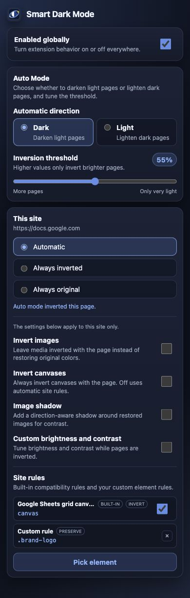

# Smart Dark Mode

Smart Dark Mode is a Firefox and Chromium extension that adapts a page to your
preferred light or dark direction. It samples the visible page and applies a
reversible color transformation only when needed. Images and embedded media
keep their original appearance by default. Per-site controls cover
canvas-based editors and unusual layouts.

<p align="center">
  
</p>

## Highlights

- Darken mostly light pages or lighten mostly dark pages automatically.
- Leave images, video, canvases, iframes, objects, and embeds unchanged by
  default rather than inverting them with the page.
- Choose Automatic, Always inverted, or Always original for each origin.
- Adjust the detection threshold, brightness, contrast, image shadows, and
  canvas behavior.
- Preserve or invert selected elements, combine selectors, and disable bundled
  compatibility rules.
- Use built-in rules for the canvas document surfaces in Google Docs and Google
  Sheets.
- Handle DOM updates and open Shadow DOM, including late hydration during the
  first ten seconds.
- Keep browsing local: no accounts, analytics, telemetry, remote code, or
  browsing-data transmission.

## How it works

1. A small grid of points across the visible viewport is sampled after the page loads.
2. Composited background colors are converted to relative luminance and compared with the selected threshold.
3. When inversion is needed, the document receives an `invert(1) hue-rotate(180deg)` filter with optional brightness and contrast correction.
4. Media receives a counter-filter so photos, video, and embedded content remain natural.
5. Built-in and custom site rules apply last, allowing explicit choices to override automatic behavior.

The extension remembers the last automatic result for each origin to reduce flashes during navigation.

## Site rules

Rules use ordinary CSS selectors and are scoped to the current origin.

| Rule | Effect |
| --- | --- |
| **Preserve** | Counter-inverts matching elements so they retain their original appearance. |
| **Invert** | Leaves matching elements under the page inversion. Useful for canvas-based document surfaces. |
| **Built-in** | A shipped compatibility rule for the current page. It can be disabled from the popup. |

The element picker previews matches in pink before saving. Multiple checked selectors are stored as one comma-separated rule that matches any of them. Explicit custom rules take precedence over built-in rules and media defaults, including when **Invert images** is enabled.

## Install locally

### Firefox

Temporary installation:

1. Open `about:debugging#/runtime/this-firefox`.
2. Select **Load Temporary Add-on…**.
3. Choose this repository's `manifest.json`.

Or launch a development profile:

```sh
npm install
npm run run:firefox
```

The Firefox manifest targets Firefox 142 or newer.

### Chrome / Chromium

```sh
npm install
npm run stage:chrome
```

Then open `chrome://extensions`, enable **Developer mode**, choose **Load unpacked**, and select `build/chrome`.

## Permissions and privacy

Smart Dark Mode processes pages entirely in the browser. Settings and per-site choices are saved with extension storage and are not sent anywhere.

| Permission | Why it is used |
| --- | --- |
| `storage` | Saves global preferences, per-site settings, and automatic results. |
| `activeTab` | Reads the current tab when the popup is opened. |
| `contextMenus` | Adds **Reset site to Automatic** to the toolbar-button menu. |
| `<all_urls>` | Allows the content script to detect and transform pages where the extension is enabled. |

The extension contains no analytics, telemetry, advertising, remote scripts, or network requests. The Firefox manifest explicitly declares no data collection.

## Development

### Validate and test

```sh
npm test
npm run validate
npm run lint:firefox
```

Open pages listen for storage changes, so most setting updates apply without reloading the tab.

### Stage and package

```sh
npm run stage:firefox   # build/firefox
npm run stage:chrome    # build/chrome
npm run stage           # both unpacked builds

npm run build:firefox   # dist/firefox/*.zip
npm run build:chrome    # dist/chrome/*.zip
npm run build           # both release archives
```

PNG toolbar icons are generated from the SVG source during staging and builds. Browser-specific release manifests live in `manifests/`; the root manifest is used for Firefox development.

### Project layout

```text
src/             content script, popup, picker, background, and shared config
manifests/       Firefox and Chrome release manifests
icons/           SVG icon sources and generated PNG sizes
brand/           logo explorations and future identity assets
test-fixtures/   manual compatibility pages
tests/           Node-based rule and configuration tests
store-assets/    listing screenshots and promotional assets
scripts/         build, icon, and store-publishing helpers
```

<details>
<summary>Manual compatibility fixtures</summary>

- `light.html` and `dark.html` exercise automatic detection in both directions.
- `dynamic.html` covers content added after activation.
- `mixed-media.html` checks media restoration.
- `site-rules.html` exercises the selector picker and custom preserve rules.
- `shadow-dom.html` covers early, late, nested, and closed Shadow DOM.
- `complex-layouts.html` covers iframes, authored filters, inline SVG, dialogs, fixed/sticky positioning, and legacy markup.
- `legacy-frameset.html` checks old `<frameset>` and `<frame>` applications.

</details>

## Release automation

GitHub Actions validates and builds both browser packages on pushes and pull requests. The manual release workflow creates release archives and can publish to AMO and the Chrome Web Store when the required secrets are configured.

## Known limitations

Smart Dark Mode intentionally uses a page-level CSS filter for broad, fast coverage. Some complex compositing cases cannot be perfectly restored.

- CSS background images cannot be independently counter-inverted.
- Cross-origin iframes and nested filtered content may need a site rule.
- Restoring media replaces its authored `filter` property while inversion is active.
- Open shadow roots attached more than ten seconds after activation may be missed if no light-DOM mutation accompanies them.
- Closed shadow roots cannot be inspected; preserve their host with a custom rule or `data-auto-dark-mode-exempt`.

## License

MIT — see [LICENSE](LICENSE).
